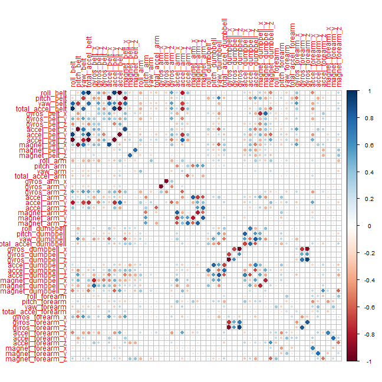

```r
xprint<-function(x,...) print(xtable(x),type="html")
```


For the safety purposes, e.g. missing the source datasource activity.zip or in case the script runs in a wrong 
directory, there is a code which can download the zip file from the original site.


## Loading and preprocessing the data


```r
# Actually reading the data and converting to data.table
trainingtbl<-tbl_df(read.csv(trainingDS, stringsAsFactors=FALSE))
testtbl<-tbl_df(read.csv(testDS, stringsAsFactors=FALSE))
```

The naive cleaning strategy:

 1. Remove all columns with NAs
 
 2. Remove all incomplete rows

In addition, all columns absent in test set should be removed 
(however, the it happens anyway).


```r
exclCols <- c("X","raw_timestamp_part_1","raw_timestamp_part_2","num_window")


goodNumCols <- function(df) {
        goodCols<-unlist(lapply(df, function(x) all(!is.na(x) & is.numeric(x))))
        goodNames<-colnames(df)[goodCols]
        base::setdiff(x=goodNames,y=exclCols)  
}

trainDFWithUser<-trainingtbl[,c("classe","user_name",goodNumCols(trainingtbl))]
                          
# User_name only for the data review, will be excluded rightaway
trainDFWithUser<-trainDFWithUser[complete.cases(trainDFWithUser),] 
trainDFWithUser$classe <- as.factor(trainDFWithUser$classe)
trainDFWithUser$user_name <- as.factor(trainDFWithUser$user_name)
trainDF<-trainDFWithUser %>% select(-user_name) # Exclude user from features


testDF<-testtbl[,intersect(colnames(testtbl),colnames(trainDF))]
```

## Evaluate training data quality: skewness of the classes


```r
t1<-xtabs(data=trainDFWithUser,~user_name+classe) # preview how balanced is the data
t2<-xtabs(data=trainDF,~classe)
print(xtable(t1),type="html")
```

<!-- html table generated in R 3.1.2 by xtable 1.7-4 package -->
<!-- Sun Dec 21 01:40:00 2014 -->
<table border=1>
<tr> <th>  </th> <th> A </th> <th> B </th> <th> C </th> <th> D </th> <th> E </th>  </tr>
  <tr> <td align="right"> adelmo </td> <td align="right"> 1165.00 </td> <td align="right"> 776.00 </td> <td align="right"> 750.00 </td> <td align="right"> 515.00 </td> <td align="right"> 686.00 </td> </tr>
  <tr> <td align="right"> carlitos </td> <td align="right"> 834.00 </td> <td align="right"> 690.00 </td> <td align="right"> 493.00 </td> <td align="right"> 486.00 </td> <td align="right"> 609.00 </td> </tr>
  <tr> <td align="right"> charles </td> <td align="right"> 899.00 </td> <td align="right"> 745.00 </td> <td align="right"> 539.00 </td> <td align="right"> 642.00 </td> <td align="right"> 711.00 </td> </tr>
  <tr> <td align="right"> eurico </td> <td align="right"> 865.00 </td> <td align="right"> 592.00 </td> <td align="right"> 489.00 </td> <td align="right"> 582.00 </td> <td align="right"> 542.00 </td> </tr>
  <tr> <td align="right"> jeremy </td> <td align="right"> 1177.00 </td> <td align="right"> 489.00 </td> <td align="right"> 652.00 </td> <td align="right"> 522.00 </td> <td align="right"> 562.00 </td> </tr>
  <tr> <td align="right"> pedro </td> <td align="right"> 640.00 </td> <td align="right"> 505.00 </td> <td align="right"> 499.00 </td> <td align="right"> 469.00 </td> <td align="right"> 497.00 </td> </tr>
   </table>

```r
print(xtable(t2),type="html")
```

<!-- html table generated in R 3.1.2 by xtable 1.7-4 package -->
<!-- Sun Dec 21 01:40:00 2014 -->
<table border=1>
<tr> <th>  </th> <th> classe </th>  </tr>
  <tr> <td align="right"> A </td> <td align="right"> 5580.00 </td> </tr>
  <tr> <td align="right"> B </td> <td align="right"> 3797.00 </td> </tr>
  <tr> <td align="right"> C </td> <td align="right"> 3422.00 </td> </tr>
  <tr> <td align="right"> D </td> <td align="right"> 3216.00 </td> </tr>
  <tr> <td align="right"> E </td> <td align="right"> 3607.00 </td> </tr>
   </table>


**Conclusion:** The data is well balanced, it is not skewed in any way  


## Feature analysis: correlation
The correlation analysis can establish whether dimensionality reduction is justified:

```r
trainDF.scale<- scale(trainDF[,-1], center=TRUE, scale=TRUE);
M <- cor(trainDF.scale)
diag(M)<-0
naiveDimEstimation <- sqrt(length(which(abs(M)<0.1,arr.ind=T))/2)
cat(sprintf("Low correlated entries  (rough estimation): %f", naiveDimEstimation))
```

Low correlated entries  (rough estimation): 36.878178
The correlation plot:

```r
corrplot(M)
```

 

**Conclusion:** There are some correlated features, mainly trelated to the same sensor, but the correlation between the groups is not too strong.

If the classifier can handle this data, the effort of dimensionality reduction is probably is not justified here.


## Training the classifier 


The selected classifier: random forest.
This classifier does not require feature normalization and less sensitive to feature pre-processing:

```r
library(caret)
set.seed(3233)

inTrain     <-createDataPartition(trainDF$classe, p = 0.7)[[1]]
training    <- trainDF[ inTrain,]
training.cv <- trainDF[-inTrain,]


model.rf<-randomForest(classe~.,data = training,ntree=150, importance=TRUE)

model.rf
```


Call:
 randomForest(formula = classe ~ ., data = training, ntree = 150,      importance = TRUE) 
               Type of random forest: classification
                     Number of trees: 150
No. of variables tried at each split: 7

        OOB estimate of  error rate: 0.61%
Confusion matrix:
     A    B    C    D    E  class.error
A 3904    1    0    0    1 0.0005120328
B   17 2634    7    0    0 0.0090293454
C    0   19 2375    2    0 0.0087646077
D    0    0   25 2225    2 0.0119893428
E    0    0    3    7 2515 0.0039603960

** Performance on training set: **


```r
classAccuracy <- function(t) sum(diag(t))/sum(t)
misclassError <- function(t) 1-classAccuracy(t)


pred.trainrf <- predict(model.rf,newdata=training)
confusion.train<-table(pred.trainrf,training$classe)
xprint(confusion.train)
```

<!-- html table generated in R 3.1.2 by xtable 1.7-4 package -->
<!-- Sun Dec 21 01:40:23 2014 -->
<table border=1>
<tr> <th>  </th> <th> A </th> <th> B </th> <th> C </th> <th> D </th> <th> E </th>  </tr>
  <tr> <td align="right"> A </td> <td align="right"> 3906 </td> <td align="right">   0 </td> <td align="right">   0 </td> <td align="right">   0 </td> <td align="right">   0 </td> </tr>
  <tr> <td align="right"> B </td> <td align="right">   0 </td> <td align="right"> 2658 </td> <td align="right">   0 </td> <td align="right">   0 </td> <td align="right">   0 </td> </tr>
  <tr> <td align="right"> C </td> <td align="right">   0 </td> <td align="right">   0 </td> <td align="right"> 2396 </td> <td align="right">   0 </td> <td align="right">   0 </td> </tr>
  <tr> <td align="right"> D </td> <td align="right">   0 </td> <td align="right">   0 </td> <td align="right">   0 </td> <td align="right"> 2252 </td> <td align="right">   0 </td> </tr>
  <tr> <td align="right"> E </td> <td align="right">   0 </td> <td align="right">   0 </td> <td align="right">   0 </td> <td align="right">   0 </td> <td align="right"> 2525 </td> </tr>
   </table>

```r
cat(sprintf("Train accuracy: %.2f", classAccuracy(confusion.train)))
```

Train accuracy: 1.00


**Features importance review: top 10:** 


```r
imp<-data.frame(unlist(importance(model.rf,type = 2)))
xprint(head(imp[order(-imp$MeanDecreaseGini),,drop=FALSE],10))
```

<!-- html table generated in R 3.1.2 by xtable 1.7-4 package -->
<!-- Sun Dec 21 01:40:23 2014 -->
<table border=1>
<tr> <th>  </th> <th> MeanDecreaseGini </th>  </tr>
  <tr> <td align="right"> roll_belt </td> <td align="right"> 870.19 </td> </tr>
  <tr> <td align="right"> yaw_belt </td> <td align="right"> 641.65 </td> </tr>
  <tr> <td align="right"> magnet_dumbbell_z </td> <td align="right"> 538.29 </td> </tr>
  <tr> <td align="right"> pitch_forearm </td> <td align="right"> 517.83 </td> </tr>
  <tr> <td align="right"> pitch_belt </td> <td align="right"> 487.61 </td> </tr>
  <tr> <td align="right"> magnet_dumbbell_y </td> <td align="right"> 484.34 </td> </tr>
  <tr> <td align="right"> roll_forearm </td> <td align="right"> 411.60 </td> </tr>
  <tr> <td align="right"> magnet_dumbbell_x </td> <td align="right"> 335.23 </td> </tr>
  <tr> <td align="right"> accel_belt_z </td> <td align="right"> 315.14 </td> </tr>
  <tr> <td align="right"> accel_dumbbell_y </td> <td align="right"> 288.63 </td> </tr>
   </table>

**Performance on cross-validation set:**


```r
# Quality estimation
mpredcv.rf <- predict(model.rf,newdata=training.cv)
confusion.cv<-table(mpredcv.rf,training.cv$classe)
xprint(confusion.cv)
```

<!-- html table generated in R 3.1.2 by xtable 1.7-4 package -->
<!-- Sun Dec 21 01:40:23 2014 -->
<table border=1>
<tr> <th>  </th> <th> A </th> <th> B </th> <th> C </th> <th> D </th> <th> E </th>  </tr>
  <tr> <td align="right"> A </td> <td align="right"> 1670 </td> <td align="right">   9 </td> <td align="right">   0 </td> <td align="right">   0 </td> <td align="right">   0 </td> </tr>
  <tr> <td align="right"> B </td> <td align="right">   4 </td> <td align="right"> 1127 </td> <td align="right">   8 </td> <td align="right">   0 </td> <td align="right">   0 </td> </tr>
  <tr> <td align="right"> C </td> <td align="right">   0 </td> <td align="right">   3 </td> <td align="right"> 1018 </td> <td align="right">   8 </td> <td align="right">   0 </td> </tr>
  <tr> <td align="right"> D </td> <td align="right">   0 </td> <td align="right">   0 </td> <td align="right">   0 </td> <td align="right"> 954 </td> <td align="right">   3 </td> </tr>
  <tr> <td align="right"> E </td> <td align="right">   0 </td> <td align="right">   0 </td> <td align="right">   0 </td> <td align="right">   2 </td> <td align="right"> 1079 </td> </tr>
   </table>

```r
cat(sprintf("Cross-validation (test) accuracy: %.2f", classAccuracy(confusion.cv)))
```

Cross-validation (test) accuracy: 0.99

```r
xprint(table(training.cv$classe,mpredcv.rf))
```

<!-- html table generated in R 3.1.2 by xtable 1.7-4 package -->
<!-- Sun Dec 21 01:40:23 2014 -->
<table border=1>
<tr> <th>  </th> <th> A </th> <th> B </th> <th> C </th> <th> D </th> <th> E </th>  </tr>
  <tr> <td align="right"> A </td> <td align="right"> 1670 </td> <td align="right">   4 </td> <td align="right">   0 </td> <td align="right">   0 </td> <td align="right">   0 </td> </tr>
  <tr> <td align="right"> B </td> <td align="right">   9 </td> <td align="right"> 1127 </td> <td align="right">   3 </td> <td align="right">   0 </td> <td align="right">   0 </td> </tr>
  <tr> <td align="right"> C </td> <td align="right">   0 </td> <td align="right">   8 </td> <td align="right"> 1018 </td> <td align="right">   0 </td> <td align="right">   0 </td> </tr>
  <tr> <td align="right"> D </td> <td align="right">   0 </td> <td align="right">   0 </td> <td align="right">   8 </td> <td align="right"> 954 </td> <td align="right">   2 </td> </tr>
  <tr> <td align="right"> E </td> <td align="right">   0 </td> <td align="right">   0 </td> <td align="right">   0 </td> <td align="right">   3 </td> <td align="right"> 1079 </td> </tr>
   </table>

**Conclusion:** the expected out of sample performance is expected to be about 99%. 


**Predict the classes on the testset (final result):**
    

```r
mpredtest.rf <- predict(model.rf,newdata=testDF)
Class <- data.frame(mpredtest.rf)
xprint(table(Class))
```

<!-- html table generated in R 3.1.2 by xtable 1.7-4 package -->
<!-- Sun Dec 21 01:40:23 2014 -->
<table border=1>
<tr> <th>  </th> <th> Class </th>  </tr>
  <tr> <td align="right"> A </td> <td align="right">   7 </td> </tr>
  <tr> <td align="right"> B </td> <td align="right">   8 </td> </tr>
  <tr> <td align="right"> C </td> <td align="right">   1 </td> </tr>
  <tr> <td align="right"> D </td> <td align="right">   1 </td> </tr>
  <tr> <td align="right"> E </td> <td align="right">   3 </td> </tr>
   </table>


## Training on the whole training set for submission


```r
answers <- as.vector(Class[,1])
xprint(Class)
```

<!-- html table generated in R 3.1.2 by xtable 1.7-4 package -->
<!-- Sun Dec 21 01:40:23 2014 -->
<table border=1>
<tr> <th>  </th> <th> mpredtest.rf </th>  </tr>
  <tr> <td align="right"> 1 </td> <td> B </td> </tr>
  <tr> <td align="right"> 2 </td> <td> A </td> </tr>
  <tr> <td align="right"> 3 </td> <td> B </td> </tr>
  <tr> <td align="right"> 4 </td> <td> A </td> </tr>
  <tr> <td align="right"> 5 </td> <td> A </td> </tr>
  <tr> <td align="right"> 6 </td> <td> E </td> </tr>
  <tr> <td align="right"> 7 </td> <td> D </td> </tr>
  <tr> <td align="right"> 8 </td> <td> B </td> </tr>
  <tr> <td align="right"> 9 </td> <td> A </td> </tr>
  <tr> <td align="right"> 10 </td> <td> A </td> </tr>
  <tr> <td align="right"> 11 </td> <td> B </td> </tr>
  <tr> <td align="right"> 12 </td> <td> C </td> </tr>
  <tr> <td align="right"> 13 </td> <td> B </td> </tr>
  <tr> <td align="right"> 14 </td> <td> A </td> </tr>
  <tr> <td align="right"> 15 </td> <td> E </td> </tr>
  <tr> <td align="right"> 16 </td> <td> E </td> </tr>
  <tr> <td align="right"> 17 </td> <td> A </td> </tr>
  <tr> <td align="right"> 18 </td> <td> B </td> </tr>
  <tr> <td align="right"> 19 </td> <td> B </td> </tr>
  <tr> <td align="right"> 20 </td> <td> B </td> </tr>
   </table>

```r
modelFull.rf<-randomForest(classe~.,data = trainDF,ntree=150, importance=TRUE)

#modelFull.rf

mpredtest1.rf <- predict(model.rf,newdata=testDF)
ClassFull <- data.frame(mpredtest1.rf)
answers1 <- as.vector(Class[,1])
xprint(ClassFull)
```

<!-- html table generated in R 3.1.2 by xtable 1.7-4 package -->
<!-- Sun Dec 21 01:40:55 2014 -->
<table border=1>
<tr> <th>  </th> <th> mpredtest1.rf </th>  </tr>
  <tr> <td align="right"> 1 </td> <td> B </td> </tr>
  <tr> <td align="right"> 2 </td> <td> A </td> </tr>
  <tr> <td align="right"> 3 </td> <td> B </td> </tr>
  <tr> <td align="right"> 4 </td> <td> A </td> </tr>
  <tr> <td align="right"> 5 </td> <td> A </td> </tr>
  <tr> <td align="right"> 6 </td> <td> E </td> </tr>
  <tr> <td align="right"> 7 </td> <td> D </td> </tr>
  <tr> <td align="right"> 8 </td> <td> B </td> </tr>
  <tr> <td align="right"> 9 </td> <td> A </td> </tr>
  <tr> <td align="right"> 10 </td> <td> A </td> </tr>
  <tr> <td align="right"> 11 </td> <td> B </td> </tr>
  <tr> <td align="right"> 12 </td> <td> C </td> </tr>
  <tr> <td align="right"> 13 </td> <td> B </td> </tr>
  <tr> <td align="right"> 14 </td> <td> A </td> </tr>
  <tr> <td align="right"> 15 </td> <td> E </td> </tr>
  <tr> <td align="right"> 16 </td> <td> E </td> </tr>
  <tr> <td align="right"> 17 </td> <td> A </td> </tr>
  <tr> <td align="right"> 18 </td> <td> B </td> </tr>
  <tr> <td align="right"> 19 </td> <td> B </td> </tr>
  <tr> <td align="right"> 20 </td> <td> B </td> </tr>
   </table>

```r
pml_write_files = function(x){
  n = length(x)
  for(i in 1:n){
    filename = paste0("problem_id_",i,".txt")
    write.table(x[i],file=filename,quote=FALSE,row.names=FALSE,col.names=FALSE)
  }
}

pml_write_files(answers1)
```


